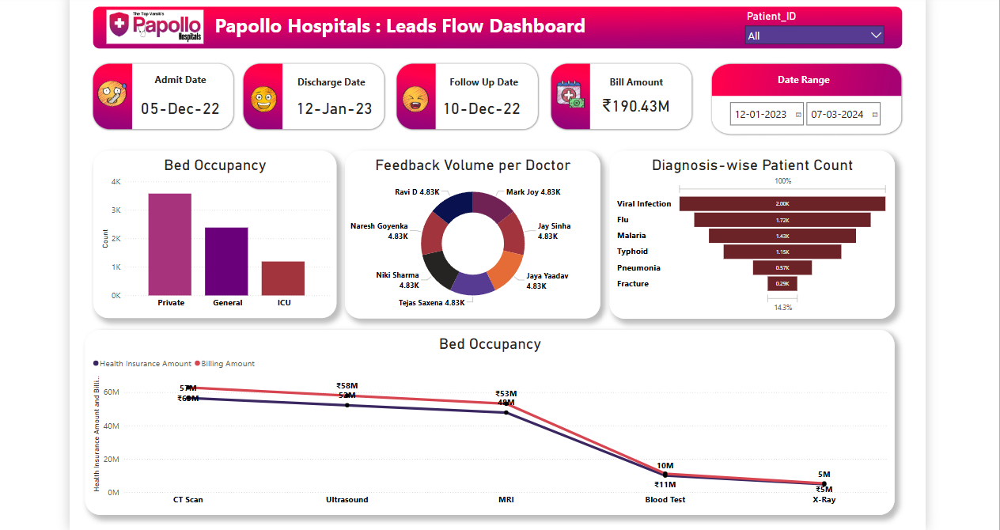

# Healthcare Analytics Dashboard (Power BI)

This project presents a healthcare analytics dashboard built in Power BI to help hospital administrators monitor patient flow, medical feedback, financial performance, and diagnosis trends.

## Objective
To analyze hospital operations and support data-driven decision-making by visualizing key healthcare metrics such as bed occupancy, diagnosis-wise patient count, and billing vs insurance coverage.

## Dataset
- hospital_data.xlsx: Contains anonymized patient data including admit/discharge dates, diagnosis, billing info, and doctor feedback.

## Dashboard Overview
The Power BI dashboard includes the following visuals:
- *Bed Occupancy* (Private, General, ICU)
- *Diagnosis-wise Patient Count* (e.g., Viral Infection, Flu, Malaria)
- *Feedback Volume per Doctor*
- *Health Insurance vs Billing Amount* (for different tests)
- *Key Filters*: Patient ID, Date Range, Admit/Discharge Dates

## Key KPIs
- Total Bill Amount
- Patient Follow-Up Date
- Time Frame Selection
- Revenue Insights from Tests

## Tools Used
- Power BI
- Excel
- DAX for calculated metrics

## Screenshot

## Insights
- Private rooms are the most occupied bed type.
- Viral infections and flu are leading causes for patient admissions.
- Certain tests like CT Scan and MRI show significant differences in billing vs insurance coverage.
- Doctor feedback volume is evenly distributed.

## Outcome
This dashboard enables a hospital to track real-time operational metrics and identify key areas to improve patient care and cost-efficiency.